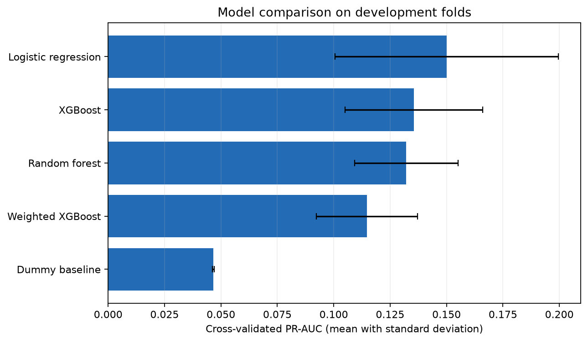
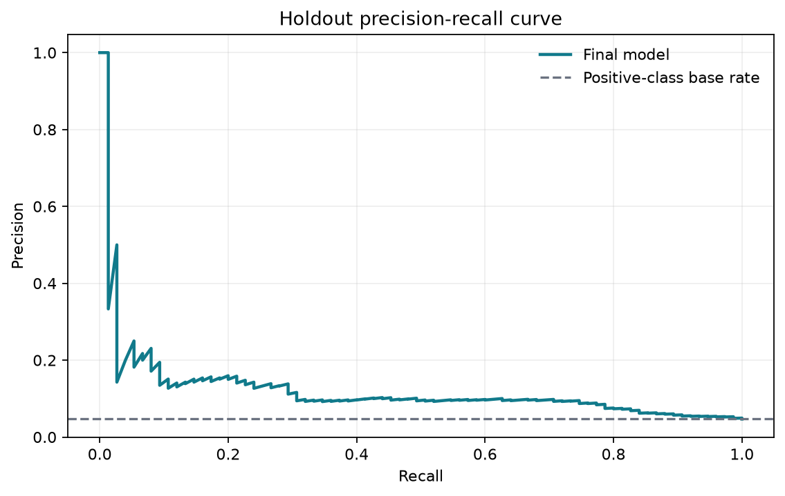
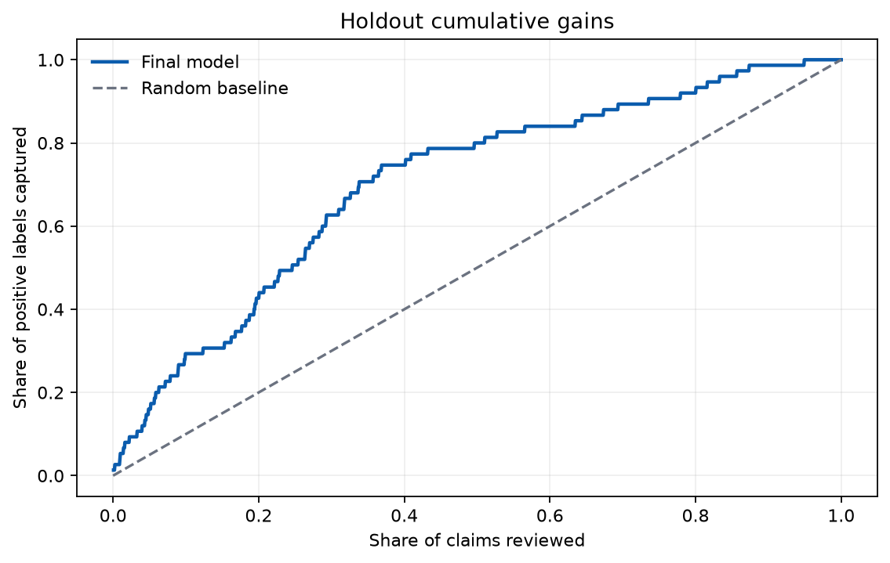
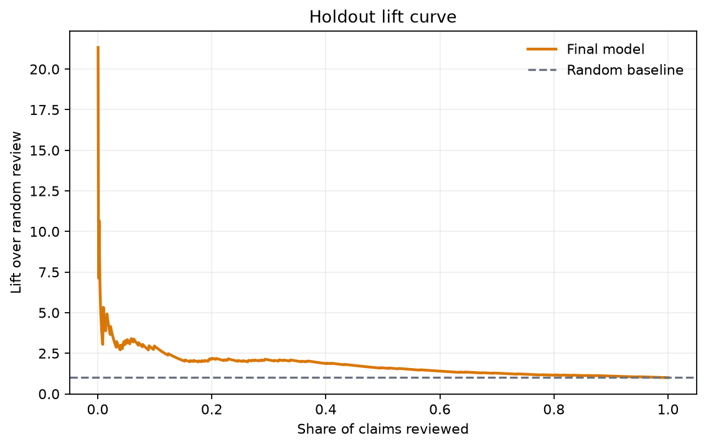
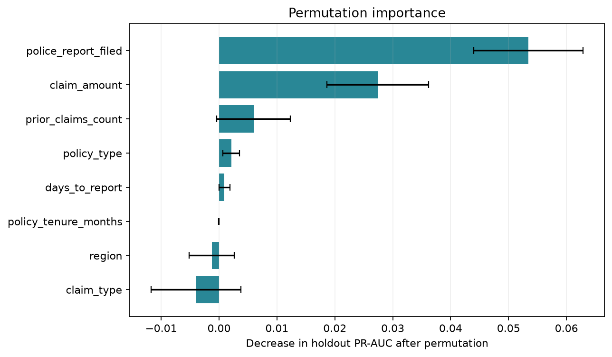

# Motor Claims Risk Triage

**Machine Learning for Capacity-Constrained Review Prioritisation**

[](https://github.com/GarethMackenzie/motor-claims-triage/actions/workflows/ci.yml)

> **Portfolio project using synthetic data only.** Every claim and label is generated in this repository. No customer, policyholder, claimant, employer or production data is used. Results describe this synthetic case study and must not be treated as real-world model performance.

## Executive summary

This project tests whether a limited review team can use a model score to prioritise synthetic claims for closer inspection. It compares five classification approaches through leakage-safe pipelines, stratified cross-validation and a final untouched holdout set.

Logistic regression was selected on development data with mean PR-AUC of **0.150 ± 0.050** across five folds. On the 1,600-claim holdout set it achieved **0.713 ROC-AUC** and **0.125 PR-AUC**. Reviewing the top 10% of scores captured **22 of 75 positive labels**, with **13.75% precision**, **29.33% recall** and **2.93x lift** over random review.

The output is an uncalibrated model score for relative review priority. It is not a fraud determination, a calibrated probability or a basis for automatic rejection.

## Business problem

The operational question is:

> If the review team can investigate only a fixed share of claims, how much of the synthetic positive class is concentrated in that queue?

A default 0.5 classification threshold does not represent that resource constraint. This project therefore evaluates ranked queues at 5%, 10%, 15% and 20% review capacity.

## Synthetic dataset

The deterministic generator creates 8,000 motor and agricultural claims with a 4.66% positive-label rate.

| Area | Fields |
|---|---|
| Claim context | `policy_type`, `claim_type`, `region` |
| Financial and history | `claim_amount`, `policy_tenure_months`, `prior_claims_count` |
| Intake signals | `days_to_report`, `police_report_filed` |
| Governance comparison | `claimant_age` |
| Identifier and target | `claim_id`, `fraud_flag` |

The target is generated from documented signals plus random noise. `claim_id` is excluded from modelling. The target name is retained for code continuity, but the model is described as risk triage because a score cannot establish fraud.

## Methodology

1. Generate the dataset with a fixed random state.
2. Reserve a stratified 20% holdout before development begins.
3. Compare models on the remaining 80% using five-fold stratified cross-validation.
4. Select the model by mean development PR-AUC, with Lift@10% as the tie-breaker.
5. Compare the selected model with and without claimant age using development folds only.
6. Fit the governed final pipeline on all development data.
7. Evaluate the holdout once and generate the tracked evidence in `results/`.

## Leakage-safe pipeline

All learned preprocessing is inside an `sklearn` `Pipeline` and `ColumnTransformer`. Imputation, scaling and one-hot encoding are fitted separately within each training fold. Unknown categories are ignored safely at scoring time. The target and claim identifier are never passed to the preprocessor.

Ordinary SMOTE was removed because interpolating one-hot encoded categorical values is difficult to justify. The comparison instead includes no-resampling baselines, class-weighted linear and tree models, and both unweighted and weighted XGBoost.

## Model comparison

Development cross-validation results are means with sample standard deviations.

| Model | ROC-AUC | PR-AUC | Precision@10% | Recall@10% | Lift@10% |
|---|---:|---:|---:|---:|---:|
| Logistic regression | 0.753 ± 0.039 | 0.150 ± 0.050 | 0.142 ± 0.036 | 0.305 ± 0.077 | 3.05 ± 0.77 |
| XGBoost | 0.719 ± 0.032 | 0.136 ± 0.031 | 0.147 ± 0.024 | 0.316 ± 0.053 | 3.16 ± 0.53 |
| Random forest | 0.750 ± 0.032 | 0.132 ± 0.023 | 0.131 ± 0.024 | 0.282 ± 0.053 | 2.82 ± 0.53 |
| Weighted XGBoost | 0.695 ± 0.025 | 0.115 ± 0.022 | 0.136 ± 0.026 | 0.292 ± 0.057 | 2.92 ± 0.57 |
| Dummy baseline | 0.500 ± 0.000 | 0.047 ± 0.000 | 0.039 ± 0.010 | 0.084 ± 0.021 | 0.84 ± 0.21 |

[Download the complete model comparison](results/model-comparison.csv)



## Final evaluation

The holdout contained 1,600 claims and 75 positive labels. The final age-excluded logistic pipeline achieved:

| Metric | Holdout result |
|---|---:|
| ROC-AUC | 0.713 |
| PR-AUC | 0.125 |
| Positive-label rate | 4.69% |

The lower holdout performance relative to the development mean is reported as observed. The holdout was not used to choose the model, the age policy or the operating point.



## Review capacity

| Review capacity | Claims flagged | Precision | Recall | False positives | False-positive rate | Lift | Positives captured |
|---:|---:|---:|---:|---:|---:|---:|---:|
| 5% | 80 | 15.00% | 16.00% | 68 | 4.46% | 3.20x | 12 |
| 10% | 160 | 13.75% | 29.33% | 138 | 9.05% | 2.93x | 22 |
| 15% | 240 | 9.58% | 30.67% | 217 | 14.23% | 2.04x | 23 |
| 20% | 320 | 10.00% | 42.67% | 288 | 18.89% | 2.13x | 32 |

[Download the operating points](results/operating-points.csv)

## Lift and gains

The gains and lift views compare the ranked holdout queue with random review. They support a capacity decision; they do not prescribe one universal threshold.

| Cumulative gains | Lift |
|---|---|
|  |  |

## Explainability

Permutation importance measures the decrease in holdout PR-AUC after each original feature is shuffled. `police_report_filed` and `claim_amount` are the strongest associations in this synthetic generator. Negative or near-zero importance indicates no reliable incremental contribution on this holdout sample.



Predictive association is not a causal relationship. Feature suitability would need independent operational and governance review before any real use.

## Governance and fairness

Claimant age was treated as a potentially sensitive input. On development folds, excluding it changed mean PR-AUC from **0.1500** to **0.1492** and Lift@10% from **3.05** to **3.12**. Under the documented rule, age is excluded when mean PR-AUC falls by no more than 0.01 and Lift@10% by no more than 0.10. The final model therefore excludes claimant age.

Region and policy type remain in the case study for comparison, but their presence does not establish operational suitability. A real implementation would require legal and compliance review, subgroup fairness testing, model-risk approval, documented human oversight, drift monitoring and an appeal or escalation process. This is not legal advice.

[Download the age comparison](results/governance-age-comparison.csv)

## Testing and CI

The pytest suite contains 14 checks covering:

- deterministic generation, schema, unique identifiers, nulls, ranges, categories and prevalence;
- target and identifier exclusion, training-only preprocessing, unknown categories and finite model output;
- top-K counts, confusion-matrix reconciliation, Precision@K, Recall@K and Lift@K;
- reproducible core scores, obvious credentials and absolute local paths.

GitHub Actions runs on pushes, pull requests and manual dispatch. It installs dependencies, compiles Python, runs tests, executes a lightweight model smoke test and validates all expected output files.

## Reproducibility

The full run uses random state 42, 8,000 generated claims, an 80/20 stratified development-holdout split and five development folds. The tracked [run manifest](results/run-manifest.json), fold results and output validator make those conditions inspectable.

```bash
python -m venv .venv
python -m pip install -r requirements.txt
python -m src.generate_data
python -m src.train
python -m pytest -q
python qa_project.py
```

For the same lightweight path used by CI:

```bash
python -m src.train --fast --output-dir results/ci
python qa_project.py --results-dir results/ci
```

## Limitations

- Synthetic signals and labels cannot establish real-world effectiveness.
- The sample has only 373 positive labels, so fold and holdout variation is material.
- There is no temporal structure, concept drift, external validation or calibrated probability model.
- The governance comparison is narrow and is not a full fairness audit.
- Review costs, investigation outcomes and downstream feedback are not modelled.

## Responsible use

The model score can only support a human-reviewed priority queue. It must not automatically reject, delay, accuse or penalise a claimant. Any real deployment would need representative data, calibration review, cost analysis, security controls, monitoring, governance approval and sustained human accountability.

## Repository structure

```text
.github/workflows/ci.yml       Automated quality and smoke-test workflow
notebooks/                     Read-only review of tracked results
results/                       Version-controlled metrics, charts and manifest
scripts/validate_outputs.py    Generated-evidence validation
qa_project.py                  Final project QA gate
src/config.py                  Reproducible settings
src/generate_data.py           Synthetic data generator
src/features.py                Governed features and preprocessing
src/models.py                  Benchmark estimators
src/metrics.py                 Ranking and capacity metrics
src/evaluate.py                Cross-validation and holdout helpers
src/plots.py                   Evaluation charts
src/train.py                   Experiment orchestration
tests/                         Data, pipeline, metric and privacy checks
```
